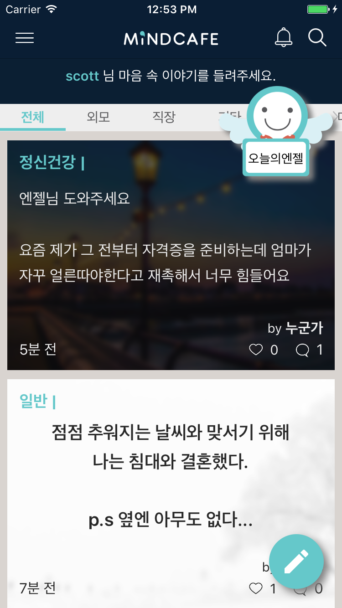
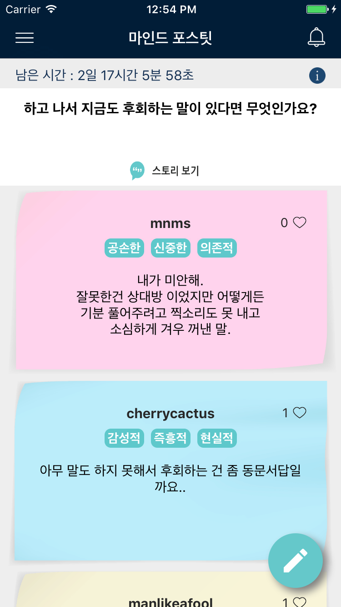
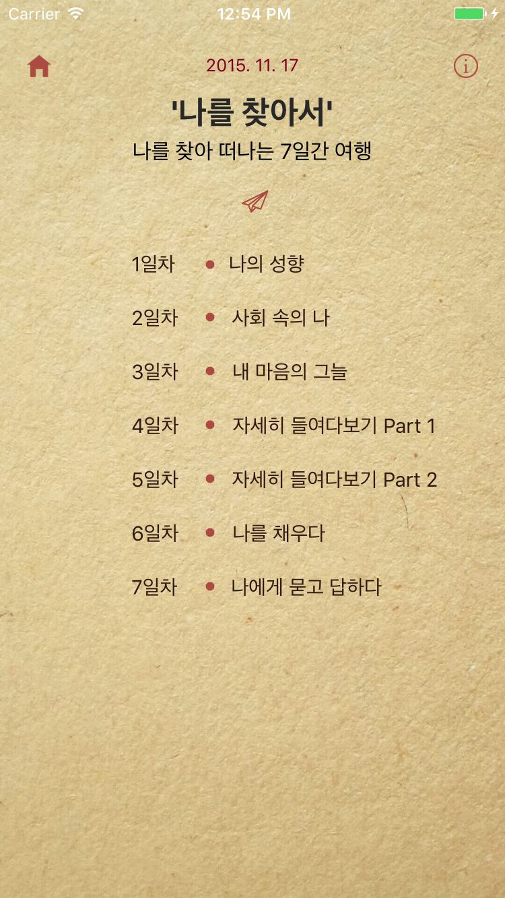
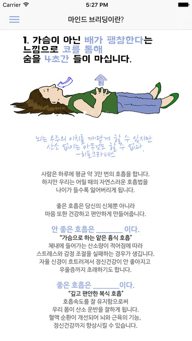
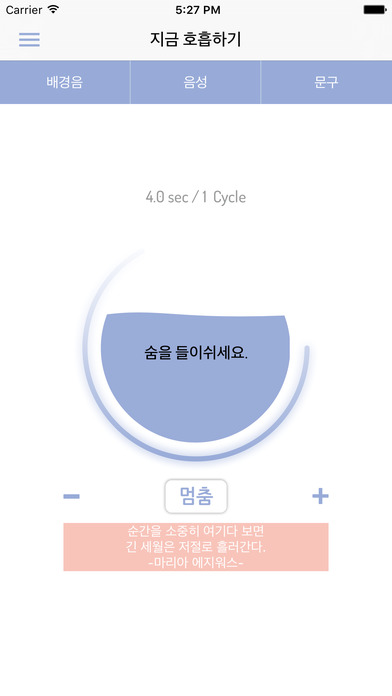
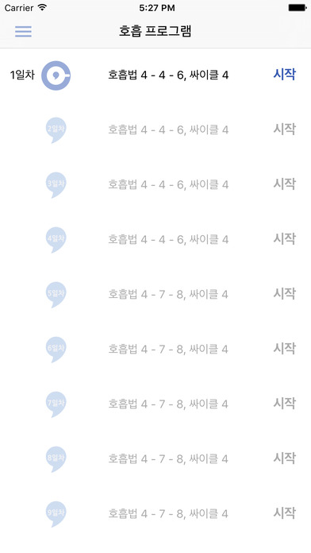
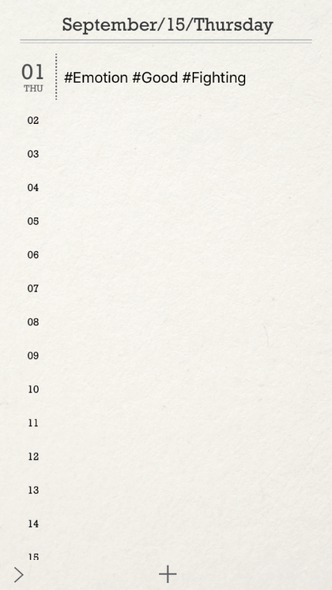
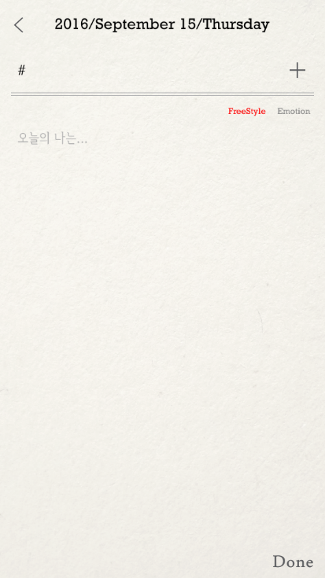
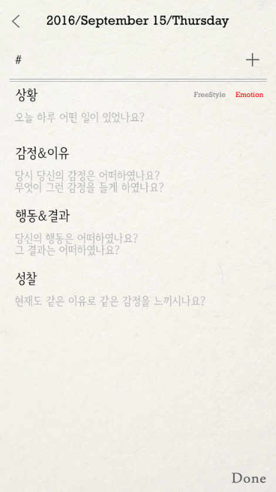

# resume
## Education
* Sejong University / Computer Software Engineering

## Career
[Atommerce](http://www.mindcafe.co.kr)
* 팀원 / Develop Team (iOS)
* 2015/08/25 ~

[OSB Savings Bank](https://www.osb.co.kr)
* 대리 / IT Operation Team
* 2014/08/25 ~ 2015/08/24

[BKL](http://bkl.co.kr)
* 주임 / IT Asset Team
* 2011/05/23 ~ 2013/08/13

[Daum Communication](http://daum.net)
* 인턴 / QA TFT
* 2010/08/24 ~ 2011/01/31

## Project (Personal)
[3x3 Numbers](https://play.google.com/store/apps/details?id=azsha.Numbers)
* 설명: 스도쿠 게임
* 기간: 2014.04 ~ 2014.05
* 언어: Java(Android)

## Project (Official)
AngelCounceling

 
* 설명: 원하는 상담사를 이어줘 결재후 개인 상담할 수 있는 앱
* 기간: 2016.09 ~ (개발중)
* 언어: Swift(iOS)

[MindCafe](https://itunes.apple.com/kr/app/maindeukape/id1071543312?mt=8)

  
* 설명: 익명 고민 SNS / 자가 진단 앱 (Atommerce 주 서비스)
* 기간: 2015.10 ~ 2016.01 (계속 업데이트)
* 언어: Swift(iOS)

[MindBreathing](https://itunes.apple.com/kr/app/maindeubeuliding/id1076233168?mt=8)

  
* 설명: 복식호흡법 가이드 앱
* 기간: 2015.09 ~ 2015.10
* 언어: Swift(iOS)

MindDay

  
* 설명: 개인 감정 일기장 앱
* 기간: 2015.08 ~ 2015.09
* 언어: Swift(iOS)

BKL HomePage
* 설명: 사내 홈페이지 제작
* 기간: 2010.11 ~ 2011.01
* 언어: JSP, JavaScript, HTML

## Site
[Blog](http://azsha.tistory.com)

[GitHub](http://www.github.com/azsha)
