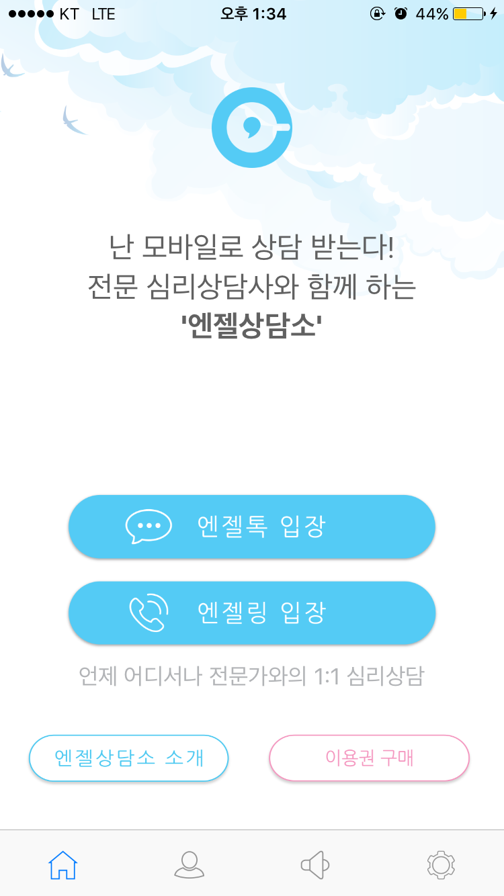
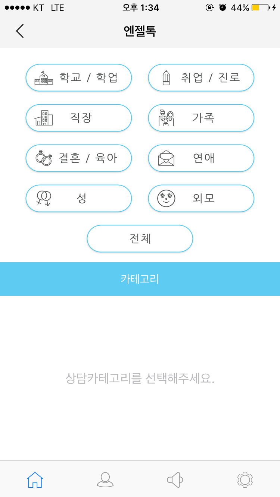

# resume
### Contact
* Email: azsha@naver.com

### Education
* Sejong University / Computer Software Engineering

### Career
[BraveCompany](http://www.bravecompany.net)
* 대리 / Develop Team (iOS)
* 2017/04/24 ~

[Atommerce](http://www.mindcafe.co.kr)
* 맴버 / Develop Team (iOS)
* 2015/08/25 ~ 2017.03.31

[OSB Savings Bank](https://www.osb.co.kr)
* 대리 / IT Operation Team
* 2014/08/25 ~ 2015/08/24

[BKL](http://bkl.co.kr)
* 주임 / IT Asset Team
* 2011/05/23 ~ 2013/08/13

## Project
### Personal Project
[3x3 Numbers](https://play.google.com/store/apps/details?id=azsha.Numbers)
* 설명: 스도쿠 게임
* 기간: 2014.04 ~ 2014.05
* 언어: Java(Android)

### Official Project
BraveCompany 인터넷 강의 수강 iOS App
* 용감한 컴퍼니에서 서비스 중인 24개의 사이트의 인터넷 강의 수강앱
* 기간: 2017.04 ~
* 언어: Swift(iOS)

BraveCompany 영단어 트레이닝 iOS app
* 용감한 컴퍼니에서 서비스 중인 영단어 트레이닝 앱
* 기간: 2017.04 ~
* 언어: Swift(iOS)

BraveCompany 성적관리 앱 iOS App
* 용감한 컴퍼니에서 서비스 중인 2개의 오프라인 학원의 성적 관리 수강앱
* 기간: 2017.04 ~
* 언어: Swift(iOS)

BraveCompany 학습관리 앱 iOS App
* 용감한 컴퍼니에서 서비스 중인 1개의 오프라인 학원의 학습 관리 수강앱
* 기간: 2017.04 ~
* 언어: Swift(iOS)

AngelCounceling

 
* 원하는 상담사를 이어줘 결재후 개인 상담할 수 있는 앱
* 기간: 2016.09 ~ 2017.03.31
* 언어: Swift(iOS)

[MindCafe](https://itunes.apple.com/kr/app/maindeukape/id1071543312?mt=8)

  
* 익명 고민 SNS / 자가 진단 앱 (Atommerce 주 서비스)
* 기간: 2015.10 ~ 2016.01 (계속 업데이트)
* 언어: Swift(iOS)

[MindBreathing](https://itunes.apple.com/kr/app/maindeubeuliding/id1076233168?mt=8)

  
* 복식호흡법 가이드 앱
* 기간: 2015.09 ~ 2015.10
* 언어: Swift(iOS)

MindDay

  
* 개인 감정 일기장 앱
* 기간: 2015.08 ~ 2015.09
* 언어: Swift(iOS)

## Site
[Blog : azsha.tistory.com](http://azsha.tistory.com)

[GitHub : github.com/azsha](http://www.github.com/azsha)
